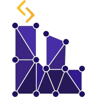

# Workshop Fábrica de Software 2025.2 — IA & ML

Bem-vindo ao repositório oficial do Workshop Fábrica de Software 2025.2, focado em Inteligência Artificial e Machine Learning!

## Sobre o Workshop

Este workshop tem como objetivo introduzir conceitos práticos de IA e ML, com atividades guiadas e desafios para estimular o aprendizado. Todo o material necessário está disponível neste repositório.

## Estrutura do Repositório

- [`2025.2`](2025.2/): Pastas referente ao ano de aplicação.
  - [`Desafio_SEUNOME_2025.2.ipynb`](Desafio_SEUNOME_2025.2.ipynb): Notebook principal do desafio.
- [`assets/`](assets): Pasta com imagens e outros recursos utilizados em terceiros.

## Materiais de Apoio

- [Python para Estatísticos](https://tmfilho.github.io/pyestbook)
- [Bibliotecas essenciais](https://github.com/Manuelfjr/processo2fase_anexo)
- [Slides das aulas de Thaís](https://sites.google.com/site/gaudenciothaisia/home/aulas)

## Contato

Dúvidas ou envio de notebooks:  
📧 desafioworkshop@gmail.com  
Assunto: **DESAFIO IA/ML 2025.2 - SEU_NOME**

## Colaboradores

  |<a href="https://www.linkedin.com/in/vinicius-vieira-de-lima/" target="_blank">**Vinícius Vieira de Lima**</a> | <a href="https://www.linkedin.com/in/pedro-leon-lopes/" target="_blank">**Pedro Lopes**</a>      |<a href="https://www.linkedin.com/in/jo%C3%A3o-wallace-b821bb1b0/" target="_blank">**Beatriz Almeida**</a> | <a href="https://www.linkedin.com/in/felipehonoratodesousa/" target="_blank">**Rafael Cirne**</a>      |
  |:-----------------------------------------------------------------------------------------:|:---------------------------------------------------------------------------------------:|:-----------------------------------------------------------------------------------------:|:---------------------------------------------------------------------------------------:|
  |                    </img>                            |                </img>                          |                    </img>                            |                </img>                          |
  |               <a href="http://github.com/irlvinicius" target="_blank">`github.com/irlvinicius`</a>      |  <a href="https://github.com/PLeonLopes" target="_blank">`github.com/PLeonLopes`</a>  |               <a href="http://github.com/beaalmeidas" target="_blank">`github.com/beaalmeidas`</a>      |  <a href="https://github.com/RafaelCirn3" target="_blank">`github.com/RafaelCirn3`</a>  |

  

